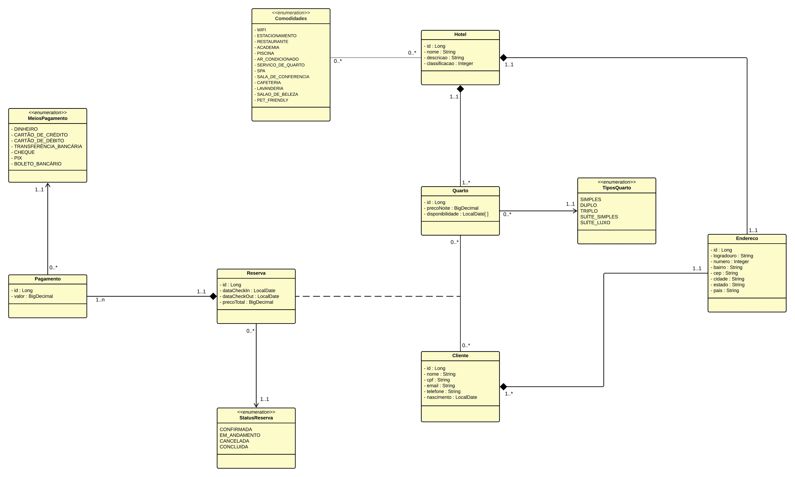
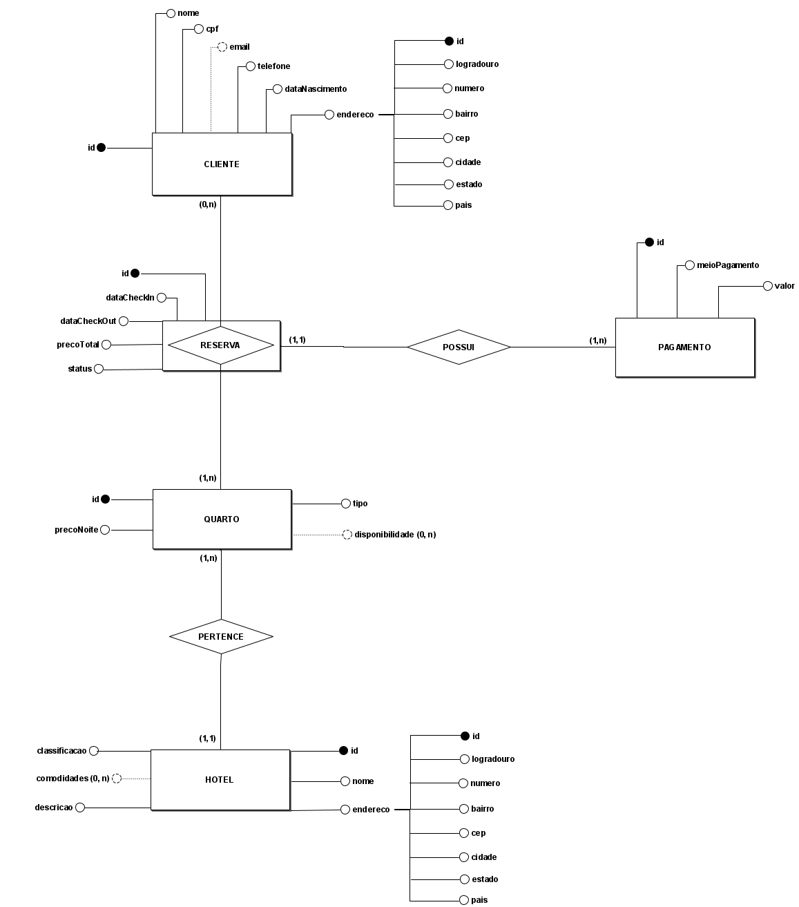
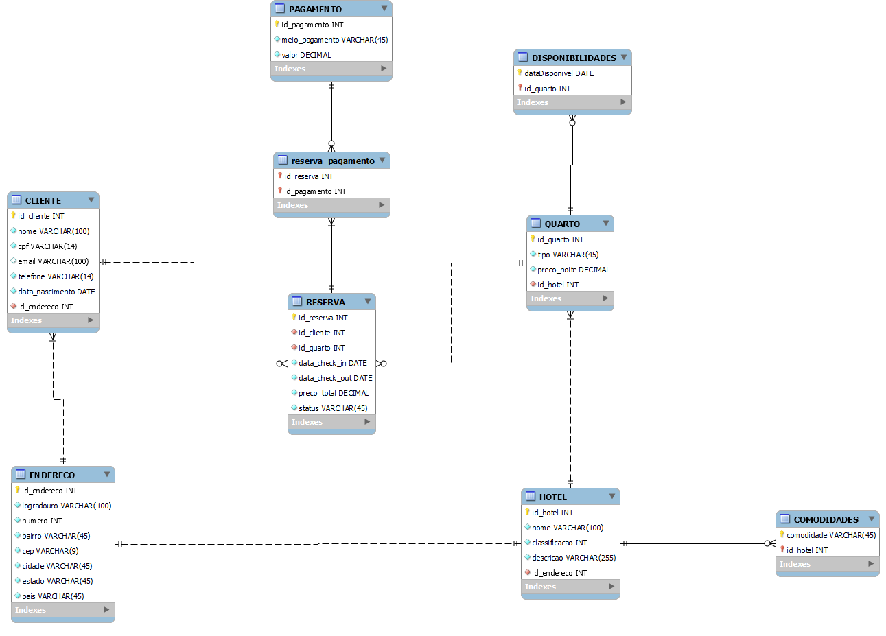

## Gerenciamento de Reserva de Hoteis

### Descrição do projeto:
<p>Este projeto é um sistema de reserva de hotéis que oferece uma variedade de endpoints para gerenciar clientes, endereços, hotéis, pagamentos, quartos e reservas.</p>

<p>Trata-se de um trabalho desenvolvido continuamente durante a disciplina de Back-End II oferecida pela instituição de ensino Uniesp Centro Universitário (João Pessoa), 
ministrada pelo professor André Farias aos alunos do curso de Sistemas para Internet do semestre 2023.2.</p>

<br/>


### Documentação da API:
#### Recurso de Clientes:
| Endpoint             | Método | Descrição                            | Exemplo                           |
|----------------------|--------|--------------------------------------|-----------------------------------|
| `/cliente/id/{id}`   | GET    | Obtém detalhes de um cliente por ID  | `GET /cliente/id/123`             |
| `/cliente/cpf/{cpf}` | GET    | Obtém detalhes de um cliente por CPF | `GET /cliente/cpf/000.111.222-33` |
| `/cliente/all`       | GET    | Obtém a lista de todos os clientes   | `GET /cliente/all`                |
| `/cliente`           | POST   | Cria um novo cliente                 | `POST /cliente` com corpo JSON    |
| `/cliente/{id}`      | PUT    | Atualiza um cliente por ID           | `PUT /cliente/123` com corpo JSON |
| `/cliente/{id}`      | DELETE | Exclui um cliente por ID             | `DELETE /cliente/123`             |
<br/>

#### Recurso de Endereços:
| Endpoint              | Método | Descrição                             | Exemplo                            |
|-----------------------|--------|---------------------------------------|------------------------------------|
| `/endereco/{id}`      | GET    | Obtém detalhes de um endereco por ID  | `GET /endereco/123`                |
| `/endereco/all`       | GET    | Obtém a lista de todos os enderecos   | `GET /endereco/all`                |
| `/endereco/{id}`      | PUT    | Atualiza um endereço por ID           | `PUT /endereco/123` com corpo JSON |
<br/>

#### Recurso de Hotéis:
| Endpoint                 | Método | Descrição                             | Exemplo                         |
|--------------------------|--------|---------------------------------------|---------------------------------|
| `/hotel/id/{id}`         | GET    | Obtém detalhes de um hotél por ID     | `GET /hotel/id/123`             |
| `/hotel/cidade/{cidade}` | GET    | Obtém detalhes de um hotél por cidade | `GET /hotel/cidade/Recife`      |
| `/hotel/all`             | GET    | Obtém a lista de todos os hotéis      | `GET /hotel/all`                |
| `/hotel`                 | POST   | Cria um novo hotél                    | `POST /hotel` com corpo JSON    |
| `/hotel/{id}`            | PUT    | Atualiza um hotél por ID              | `PUT /hotel/123` com corpo JSON |
| `/hotel/{id}`            | DELETE | Exclui um hotél por ID                | `DELETE /hotel/123`             |
<br/>

#### Recurso de Pagamentos:
| Endpoint                   | Método | Descrição                                  | Exemplo                             |
|----------------------------|--------|--------------------------------------------|-------------------------------------|
| `/pagamento/{id}`          | GET    | Obtém detalhes de um pagamento por ID      | `GET /pagamento/123`                |
| `/pagamento/all`           | GET    | Obtém a lista de todos os pagamentos       | `GET /pagamento/all`                |
| `/pagamento`               | POST   | Cria um novo pagamento                     | `POST /pagamento` com corpo JSON    |
| `/pagamento/{id}`          | PUT    | Atualiza um pagamento por ID               | `PUT /pagamento/123` com corpo JSON |
<br/>

#### Recurso de Quartos:
| Endpoint                       | Método | Descrição                                              | Exemplo                              |
|--------------------------------|--------|--------------------------------------------------------|--------------------------------------|
| `/quarto/{id}`                 | GET    | Obtém detalhes de um quarto por ID                     | `GET /quarto/123`                    |
| `/quarto/all`                  | GET    | Obtém a lista de todos os quartos                      | `GET /quarto/all`                    |
| `/quarto/disponiveis?{data}`   | GET    | Obtém a lista de todos os quartos disponíveis por data | `GET /quarto/disponiveis?2024-01-01` |
| `/quarto/disponibilidade/{id}` | GET    | Obtém todas as datas disponíveis de um quarto          | `GET /quarto/disponibilidade/123`    |
| `/quarto`                      | POST   | Cria um novo quarto                                    | `POST /quarto` com corpo JSON        |
| `/quarto/{id}`                 | PUT    | Atualiza um quarto por ID                              | `PUT /quarto/123` com corpo JSON     |
| `/quarto/{id}`                 | DELETE | Exclui um quarto por ID                                | `DELETE /quarto/123`                 |
<br/>

#### Recurso de Reservas:
| Endpoint                       | Método  | Descrição                            | Exemplo                             |
|--------------------------------|---------|--------------------------------------|-------------------------------------|
| `/reserva/{id}`                | GET     | Obtém detalhes de uma reserva por ID | `GET /reserva/123`                  |
| `/reserva/all`                 | GET     | Obtém a lista de todas as reservas   | `GET /reserva/all`                  |
| `/reserva`                     | POST    | Cria uma nova reserva                | `POST /reserva` com corpo JSON      |
| `/reserva/{id}`                | PUT     | Atualiza uma reserva por ID          | `PUT /reserva/123` com corpo JSON   |
| `/reserva/{id}`                | DELETE  | Exclui uma reserva por ID            | `DELETE /reserva/123`               |
<br/>

#### Recurso para Autenticação:
| Endpoint         | Método | Descrição                                | Exemplo                           |
|------------------|--------|------------------------------------------|-----------------------------------|
| `/auth/login`    | POST   | Realiza o login de um usuário do sistema | `POST /auth/login` com corpo JSON |
| `/auth/register` | POST   | Cadastra um novo usuário                 | `POST /auth/login` com corpo JSON |
<br/>


### Tecnologias utilizadas:
[](https://www.oracle.com/java/technologies/javase/17all-relnotes.html)
[](https://spring.io/projects/spring-boot)
[](https://spring.io/projects/spring-data-jpa)
[](https://spring.io/projects/spring-security)
[-4.4.0-blue)](https://github.com/auth0/java-jwt)
[](https://dev.mysql.com/doc/connector-j/en/)
[](https://projectlombok.org/)
[](https://springdoc.org/)

Este projeto utiliza diversas tecnologias, incluindo Java, Spring Boot, Spring Data JPA para persistência de dados, Spring Security para segurança, JWT (Java JWT) para autenticação, MySQL como banco de dados, Lombok para simplificação de código e Springdoc OpenAPI para documentação de API.
<br/>
<br/>


### Executando o projeto localmente:

#### Requisitos:
- Java versão 17
- Apache Maven
- MySQL Server
- Git
- IDE de sua preferência (Intellij, Eclipse, etc.)
- Postman (opcional)

<br/>

#### Passo-a-passo:
1. Clone o repositório do Github
```bash
git clone https://github.com/Andreia-Nunes/reserva-hoteis.git
```
2. Importe o projeto em sua IDE.
3. Crie uma instância de banco de dados MySQL chamada "reserva_hoteis".
4. Ajuste as configurações de username e password presentes no arquivo "application.properties", se necessário.
4. Crie, no banco de dados (tabela users), um primeiro usuário com o perfil ADMIN. Isso será necessário para acessar os endpoints da aplicação e criar os demais usuários.
5. Execute a classe principal "ReservaHoteisApplication" para iniciar o aplicativo.
6. O aplicativo pode ser consumido via Swagger ou Postman. No primeiro caso, acessar o endereço http://localhost:8080/swagger-ui/index.html no seu navegador.
7. Execute uma requisição de login (POST para "/auth/login") para obter o token JWT. Passe, no corpo da requisição, as credenciais do usuário com perfil ADMIN criado no passo 4.
8. Obtenha o token JWT que será retornado.
9. Acesse os demais endpoints, passando o token obtido através do cabeçalho "Authentication" das requisições HTTP.
10. Se necessário, crie outros usuários para o sistema, através do endpoint "/auth/register". Os perfis permitidos são ADMIN e USER.

<br/>


### Diagrama de Classes:


<br/>


### Modelo Entidade-Relacionamento:


<br/>


### Modelo Relacional:


<br/>


### Autora:
| [<br><sub>Andréia Nunes Pereira</sub>](www.linkedin.com/in/andréia-nunes-21b389136) | 
|----------------------------------------------------------------------------------------------------------------------------------------| 

