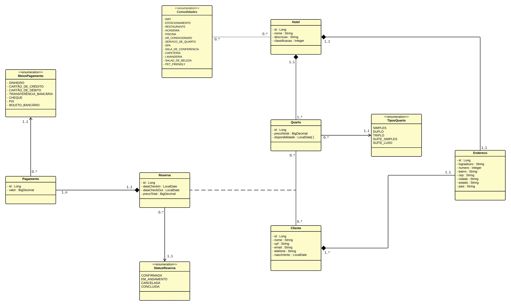
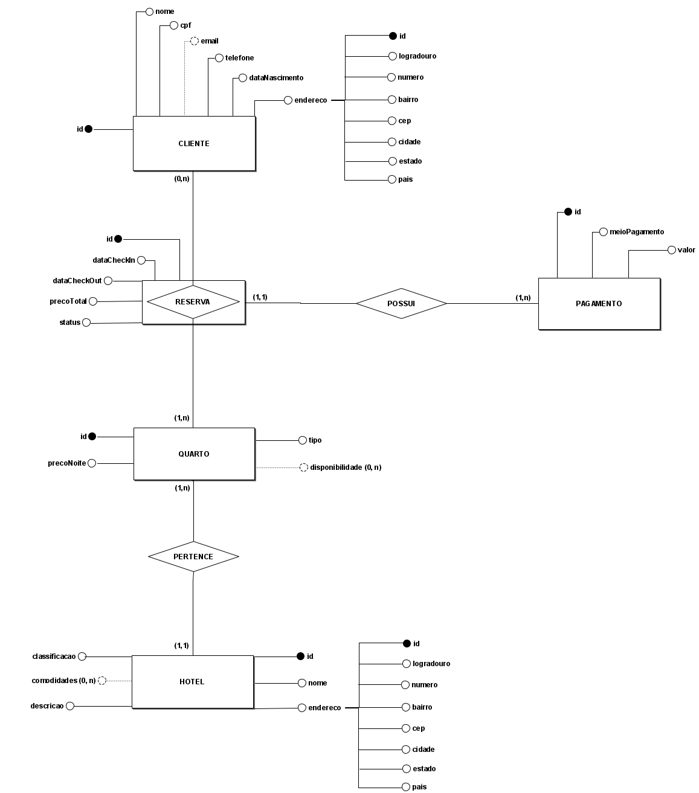
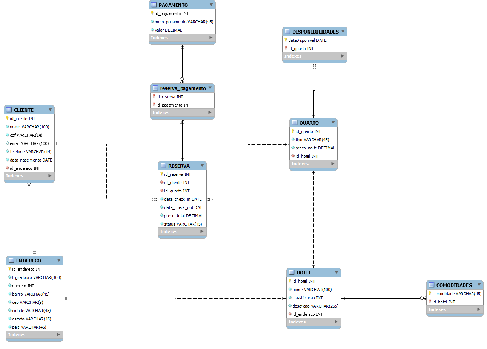

## Gerenciamento de Reserva de Hoteis

### Visão geral do projeto:

Sistema de reservas de hotéis que permite aos usuários procurar hotéis, visualizar detalhes do hotel e fazer reservas.

O projeto será desenvolvido utilizando a linguagem Java, o framework Spring Boot e outros módulos do ecossistema Spring, e o banco de dados MySql.

Trata-se de um trabalho desenvolvido continuamente durante a disciplina de Back-End II oferecida pela instituição de ensino Uniesp Centro Universitário (João Pessoa), 
ministrada pelo professor André Farias aos alunos do curso de Sistemas para Internet do semestre 2023.2.

### Diagrama de Classes:

### Modelo Entidade-Relacionamento:

### Modelo Relacional:

##### Aluna: Andréia Nunes Pereira